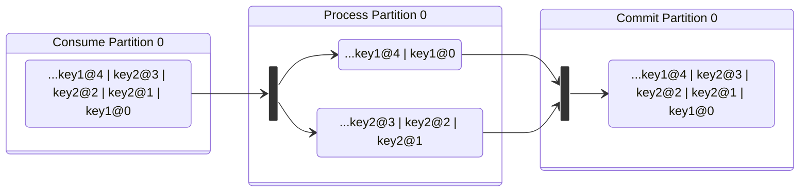

## Async Processing of Ordered Stream Events

GKES allows for the asynchronous processing of incoming records, which can be a useful feature when interacting with external systems or other high latency operations. This would seem to break the ordering promise of a Kafka partition, and it in fact does. For many use cases this is actually ok, so long as events are committed in order at the end of the consume/produce cycle of you consumer group (a commit is actually a Kafka produce call). This functionality is exposed through `EventContext.AsyncJobComplete()` method. A naive implementation might look as follows:

##### Example 1 - Naive Async (probably a bad idea):
```go

package main

import (
	"github.com/aws/go-kafka-event-source/streams"
	"github.com/aws/go-kafka-event-source/streams/sak"
)

type myJob struct {
	ctx    *streams.EventContext[myStore]
	record streams.IncomingRecord
}

func (j myJob) doSomething() {
	callExternalSystem(j)
	j.ctx.AsyncJobComplete(j.finalize)
}

func (j myJob) finalize() streams.ExecutionState {
	return streams.Complete
}

func asyncEventHander(ctx *streams.EventContext[myStore], record streams.IncomingRecord) streams.ExecutionState {
	go myJob{
		ctx:    ctx,
		record: record,
	}.doSomething()
	return streams.Incomplete
}

func main() {
	es := sak.Must(streams.NewEventSource(myConfig, myStoreFactory, asyncEventHander))
	es.ConsumeEvents()
	es.WaitForSignals(nil)
}
```

In this example, there are no interactions with the StateStore, so there are no chances for a data race condition. So long as the external process you are invoking does not care about ordering, this code works. As soon as we want ot interact with the StateStore, things become more complicated. If you don't need a StateStore, then you probably don't need GKES. As such, the above approach is not recommended.

### Avoiding Data Races

GKES provides a few async processing implementations. When these are used properly, data races will not occur.

#### StateStore Caveats

GKES will only present an EventContext to your code when no other go routine has access to it. The advantage to this is that your StateStore implementation should not require any locking for most use cases. When processing asynchronously, great care should be taken to avoid interacting with `EventContext.Store()` as other processing may be acting upon it. Even if store locking is implemented, data race conditions may still occur. The provided implementations *partially* shield your application from this condition.

**Important Note!**  If you are using an async processor that writes to a StateStore, all events for a given key must go through the async processor - even if it is a noop. Otherwise events may be processed out of order.

### AsyncJobScheduler

The [AsyncJobScheduler](https://pkg.go.dev/github.com/aws/go-kafka-event-source/streams#AsyncJobScheduler) works by breaking up your Kafka partition into it's constituent keys and creating a separate processing queue for each. Each key will be processed sequentially as the following diagram shows (where [key]@[partition offset]):



An `AsyncJobScheduler` implementation might look like this:
##### Example 2 - Notifying External Systems with Parallel Processing:
```go
package main

import (
	"github.com/aws/go-kafka-event-source/streams"
	"github.com/aws/go-kafka-event-source/streams/sak"
)

type myApp struct {
	asyncJobScheduler *streams.AsyncJobScheduler[myStore, string, myEvent]
}

// handleEvent is executed sequentiually for the events in the Kafka partition
func (app myApp) handleEvent(ctx *streams.EventContext[myStore], event myEvent) streams.ExecutionState {

	// in this example, it is assumed that your StateStore implementaion returns a streams.ChangeLogEntry
	entry := ctx.Store().update(event)

	// RecordChange will produce into the StateStoreTopic
	// (see EventSourceConfig https://pkg.go.dev/github.com/aws/go-kafka-event-source/streams#EventSourceConfig )
	// this is a non-blocking call
	ctx.RecordChange(entry)

	// please not that event.key() does not have to equal kafka record.Key(), but it must
	// be unique to the entity being acted upon.
	// In most cases event.key() will be equal to record.Key()
	return app.asyncJobScheduler.Schedule(ctx, event.key(), event)
}

// processEvent is executed sequentiually for `key`
func (app myApp) processEvent(key string, event myEvent) error {
	return callExternalSystem(event)
}

// finalizeEvent is executed sequentiually for `key`
func (app myApp) finalizeEvent(ctx *streams.EventContext[myStore], key string, event myEvent, err error) streams.ExecutionState {
	return streams.Complete
}

func main() {
    // note: in this example, incoming records must have a recordType of "myEvent"
    // defaultHandler is nil
    es := sak.Must(streams.NewEventSource(myConfig, myStoreFactory, nil))
    app := myApp{
        asyncJobScheduler: sak.Must(streams.CreateAsyncJobScheduler(es,
            app.processEvent,
            app.finalizeEvent,
            WideNetworkConfig)),
    }
    streams.RegisterEventType(es, myRecordTransformer, app.handleEvent, "myEvent")
    es.ConsumeEvents()
    es.WaitForSignals(nil)
}
```

In "Example 2", the StateStore is being updated in a synchronous manner for the partition. Then `app.processEvent` is invoked on a separate go-routine, but in-sequence for the given `event.key()`. Then, `app.finalizeEvent` is called after `app.processEvent` is completed, yet again, in-sequence for `event.key()`. Once you application returns `streams.Complete`, GKES will mark this event as eligible for a commit.

Note that `app.processEvent` does not have access to the EventContext, and thereby can not access the state store. This is because processEvent is being executed outside the context of normal partition processing. Accessing the StateStore here would undoubtedly create a race condition. Furthermore, if the data passed to `processEvent` were a pointer to a state store entry, we run the risk of concurrent access, as well as a data race. **You should only access your StateStore in one processor.** Reading from and writing to the state store for the same entity in multiple processors will create a data race condition. 

##### Example 3 - Migrating from an External DB:

Let's say that our event processing depends on data from an external system, and this data needs to be recorded in our StateStore. In this scenario, we need to ensure that we only read/write to the state store once to avoid data races. This is a less than ideal scenario, and should be avoided if possible. However, when migrating from a traditional database to a Kafka based solution, it may be unavoidable. Here's what such an implementation might look like.

```go
package main

import (
    "github.com/aws/go-kafka-event-source/streams"
    "github.com/aws/go-kafka-event-source/streams/sak"
)

type myJob struct {
    event myEvent // note this is not a pointer
    results seedData
    migrated bool
}

type myApp struct {
    asyncJobScheduler *streams.AsyncJobScheduler[myStore, string, *myJob]
}

// handleEvent is executed sequentiually for the events in the Kafka partition
func (app myApp) handleEvent(ctx *streams.EventContext[myStore], event myEvent) streams.ExecutionState {
    // please note that job is a pointer
    job := &myJob{
        event: event,
        migrated: ctx.Store().get(event.key()) != nil,
    }
    return app.asyncJobScheduler.Schedule(ctx, event.key(), job)
}

func (app myApp) migrate(key string, job *myJob) error {
    if !job.migrated {
        job.results = readFromExternalDB(job.event.key())
    }
}

// finalizeEvent is executed sequentiually for `key`
func (app myApp) finalizeEvent(ctx *streams.EventContext[myStore], key string, job *myJob, err error) streams.ExecutionState {
    // note: we're performing an additional check on the store
    // since we may have received multiple events for event.key() before
    // `finalizeEvent` has been executed
    key := job.event.key()
    if !job.migrated && ctx.Store().get(key) == nil {
        entries := ctx.Store().seed(job.results)
        ctx.RecordChange(entries...)    
    }
    entry := ctx.Store().update(key, job.event)
    ctx.RecordChange(entry)
    return streams.Complete
}

func main() {
    // note: in this example, incoming records must have a recordType of "myEvent"
    // defaultHandler is nil
    es := sak.Must(streams.NewEventSource(myConfig, myStoreFactory, nil))
    app := myApp{
        asyncJobScheduler: sak.Must(streams.CreateAsyncJobScheduler(es,
            app.migrate,
            app.finalizeEvent,
            WideNetworkConfig)),
    }
    streams.RegisterEventType(es, myRecordTransformer, app.handleEvent, "myEvent")
    es.ConsumeEvents()
    es.WaitForSignals(nil)
}
```
<<<<<<< HEAD
**Imortant!** Re-iterating - if you are using an async processor, all events for a given `key` must go through the async processor - even if it is a noop. Otherwise events may be processed out of order.
=======
**Imortant!** In this example, we are writing to the StateStore in an asynchronous process. All events for a given `key` must go through the async processor - even if it is a noop. Otherwise events may be processed out of order.
>>>>>>> 71419ef (Async processing documentation. Fixing syncBatcher implementation so that empty batches are still processed in the correct sequence.)

##### Example 4 - Chaining AsynJobSchedulers:

It is also possible to chain multiple async process together. In "Example 3", we showed how we might migrate from a traditional database to a GKES StateStore. However, while migrating, we will likely be in a "dual-write" scenario: updating both our StateStore and external database for each event until the migration process is complete. We'll modify the code from Example 3 to accomplish this:

```go
package main

import (
    "github.com/aws/go-kafka-event-source/streams"
    "github.com/aws/go-kafka-event-source/streams/sak"
)

type myJob struct {
    event myEvent // note this is not a pointer
    results seedData
    migrated bool
}

type myApp struct {
    migrationScheduler *streams.AsyncJobScheduler[myStore, string, *myJob]
    writeScheduler *streams.AsyncJobScheduler[myStore, string, myEvent]
}

// handleEvent is executed sequentiually for the events in the Kafka partition
func (app myApp) handleEvent(ctx *streams.EventContext[myStore], event myEvent) streams.ExecutionState {
    // please note that job is a pointer
    job := &myJob{
        event: event,
        migrated: ctx.Store().get(event.key()) != nil,
    }
    return app.migrationScheduler.Schedule(ctx, event.key(), job)
}

func (app myApp) migrate(key string, job *myJob) error {
    if !job.migrated {
        job.results = readFromExternalDB(job.event.key())
    }
}


func (app myApp) finalizeMigration(ctx *streams.EventContext[myStore], key string, job *myJob, err error) streams.ExecutionState {
    // note: we're performing an additional check on the store
    // since we may have received multiple events for event.key() before
    // `finalizeEvent` has been executed
    key := job.event.key()
    if !job.migrated && ctx.Store().get(key) == nil {
        entries := ctx.Store().seed(job.results)
        ctx.RecordChange(entries...)    
    }
    entry := ctx.Store().update(key, job.event)
    ctx.RecordChange(entry)
    // let's pretend we're publishing to another topic
    ctx.Forward(createSomeRecord(job.event))
	return app.writeScheduler.Schedule(key, job.event)
}

func (app myApp) writeToDB(key string, event myEvent) error {
    return writeToExternalDB(event)
}

func (app myApp) finalizeEvent(ctx *streams.EventContext[myStore], key string, event myEvent, err error) streams.ExecutionState {
    return streams.Complete
}

func main() {
    // note: in this example, incoming records must have a recordType of "myEvent"
    // defaultHandler is nil
    es := sak.Must(streams.NewEventSource(myConfig, myStoreFactory, nil))
    app := myApp{
        migrationScheduler: sak.Must(streams.CreateAsyncJobScheduler(es,
            app.migrate,
            app.finalizeMigration,
            WideNetworkConfig)),
        writeJobScheduler: sak.Must(streams.CreateAsyncJobScheduler(es,
            app.writeToDB,
            app.finalizeEvent,
            WideNetworkConfig)),
    }
    streams.RegisterEventType(es, myRecordTransformer, app.handleEvent, "myEvent")
    es.ConsumeEvents()
    es.WaitForSignals(nil)
}

```

### AsyncBatcher

The [AsyncBatcher](https://pkg.go.dev/github.com/aws/go-kafka-event-source/streams#AsyncBatcher) performs a similar function to the AsyncJobScheduler, but is intended for performing actions for multiple events at a time. This is particularly useful when interacting with systems which provide a batch API (such as SQS or DynamoDB). It's important to not that the AsyncBatcher will group together [BatchItems](https://pkg.go.dev/github.com/aws/go-kafka-event-source/streams#BatchItem) that span mutliple Kafka partitions and keys, but a given key can not exists in concurrent executions at any given point in time. As such, multiple events for the same key *can* be executed in the same batch execution. Example:

##### Example 5 - AsynBatcher DDB Write

```go

var ddbBatcher *streams.AsyncBatcher[myStore, string, myData]

func handleEvent(ctx *streams.EventContext[myStore], event myEvent) streams.ExecutionState {
    batchItems := streams.NewBatchItems(ctx, myEvent.key(), batchComplete).Add(createItemsForEvent())
    batchItems.UserData = myEvent // will be available to batchComplete if needed 
    entry := ctx.Store().update(myEvent)
    ctx.RecordChange(entry)
    return ddbBatcher.Add(batchItems)
}


func writeToDDB(items []*streams.BatchItem[string, myData]) {
    // the following logic is very naive
    // but shows how you can transmit the results of the call
    res, err := batchWriteDDBItems(items)
    for _, item := range items {
        item.Err = err
        item.UserData = res
    }
}

func batchComplete(ctx *streams.EventContext[myStore], batch *streams.Batch[myStore, string, myData]) streams.ExecutionState {
    // Here we can look at the results in batch.Items and take any necessary actions
    return streams.Complete
}

func main() {
    es := sak.Must(streams.NewEventSource(myConfig, myStoreFactory, nil))
    maxBatchSize := 50 // each DDB batch will contain no more than 50 items
    maxConcurrentBatches := 100 // the maximum number of concurrent requests to DDB
    accumulationDelay := 10 * time.Millisecond // the maximum amount of time an execution will wait to accumulate BatchItems
    ddbBatcher = streams.NewAsyncBatcher(es, writeToDDB, maxBatchSize, maxConcurrentBatches, accumulationDelay)

    streams.RegisterEventType(es, myRecordTransformer, handleEvent, "myEvent")
    es.ConsumeEvents()
    es.WaitForSignals(nil)
}

```

It is important to note that the same StateStore caveats for AsynJobScheduler also apply to the AsyncBatcher. If, in the above example, we wrote to the StateStore in the `batchComplete` function, all incoming events would need to pass through the batch mechanism. This can be accomplished by simply adding an empty with the correct key set to the AsynBatcher. As in:

```go

asynBatcher.Add(streams.NewBatchItems(ctx, key, finalizeCallback))
```

Also note that if `len(batchItems.Items())` exceeds the capacity of a batch execution (according to `maxBatchSize`), `batchItems.Items()` will be executed across multiple batches in the order in which they were added. The batch callback will be invoked only after all items for the event have been executed. 

`BatchItems.Key()` does not need to match StateStore key; but if it does not match, writing to the StateStore after the batch call could result in a data race. There are exceptions to this however. In the above example, we are writing items to a DDB table. What if these executions fail? In this case we can use the StateStore to record the errors and retry later with an Interjector. We can modify Example 5 as follows:

##### Example 6 - AsynBatcher DDB Write, Error Handling
```go

func handleEvent(ctx *streams.EventContext[myStore], event myEvent) streams.ExecutionState {
    // note that the key we are using for batching includes a prefix
    batchKey := "ddbTableName:" + myEvent.key()
    batchItems := streams.NewBatchItems(ctx, batchKey, batchComplete).Add(createItemsForEvent())
    batchItems.UserData = myEvent // will be available to batchComplete if needed 
    entry := ctx.Store().update(myEvent)
    ctx.RecordChange(entry)
    return ddbBatcher.Add(batchItems)
}


func batchComplete(ctx *streams.EventContext[myStore], batch *streams.BatchItems[myStore, string, myData]) streams.ExecutionState {
    // Here we can look at the results in batch.Items and take any necessary actions
    for _, item := range batch.Items() {
        if item.Err != nil {
            entry := ctx.Store().recordDDBWriteError(batch.Key(), time.Now().Add(time.Second), item)
            ctx.Forward(entry)
        }
    }
    return streams.Complete
}
```

Since `batch.Key()` does not intersect with `event.key()`, the 2 entries in the state store do not conflict, and there is no data race. In out event source initialization, we could schedule an Interjector to periodically poll the state store for DDB errors and retry the DDB writes. The interjector might look like this:

##### Example 7 - AsynBatcher DDB Write, Error Handling Interjector
```go

func retryDDBWrites(ctx streams.EventContext[myStore], when time.Time) streams.ExecutionState {
    // we'll delete the erros here as batchError function will re-insert of the retry fails.
    // it might be a good idea to limit the number error records returned/deleted as well
    errorRecords := ctx.Store().getAndDeleteErrorRecordsBefore(when)
    if len(errorRecords) == 0 {
        return streams.Complete
    }
    batchItems := streams.NewBatchItem(ctx, "ddbRetry", batchComplete)
    for _, errorRecord := range errorRecords {
        // note errorRecord.batchKey() should be  "ddbTableName:" + myEvent.key() from handleEvent
        batchItems.AddWithKey(errorRecord.batchKey(), errorRecord.item())
    }
    return ddbBatcher.Add(batchItems)
}

func main() {
    // eventStore initialization...
    
    // let's run through our error records every second with a 100ms jitter
    eventSource.ScheduleInterjection(retryDDBWrites, time.Second, 100 * time.Millisecond)
    eventSource.ConsumeEvents()
    eventSource.WaitForSignals(nil)
}
```